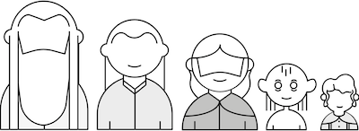

# Programming

### Learning Objectives
*After this lesson, you will be able to:*
- Define Programming.
- Write Pseudocode.

# What is programming?

A lot of this class will be centered around programming. We're going to need to learn how networks work and how to attack or defend them, which means we're going to need to be able to tell a computer to do what we want. This is what programming is for.

Programming is creating a recipe for your computer to do something. If I told you, "Go make a pizza from scratch," you probably wouldn't move. You'd probably ask, "Well, how do I make a pizza?" I'd then give you a recipe - "Take 1 cup of flour, and mix it with 1/3 cup of water. Mix it into a dough, add 4 sliced tomatoes and 1 cup of cheese, and bake at 350 degrees for 20 minutes." Only once you had a recipe would you be able to make a pizza.

Programming is making a recipe for your computer to use. A program is just a series of steps that tells your computer how to do something.

So how might you instruct a computer to pick the shortest character from Lord of the Rings?



If you asked people to identify the shortest character in the Lord of the Rings series by looking at the lineup above, they would simply compare the characters' heights and pick the little Hobbit on the right, Frodo. Computers work a little differently. They break things down into more specific steps, like a recipe.

Your first piece of your program might be:

`"Find the height of character A."`

What might the next step be?

Here are some possible instructions you could give a computer to complete this task:

```python
#1. Find the height of character A.
#2. Find the height of character B.
#3. Compare height of character A to character B.
#4. Choose the character with shorter height.
#5. Find the height of character C.
#6. Compare the height of character C to answer from Step 4.
#7. Choose the character with the shorter height.
#8. Repeat steps 5-7 for all remaining characters.
#9. Label the last character who is determined to be shorter "shortest."
```

As you can see, it takes a computer many more steps to do what humans do intuitively, but it gets there eventually!

When we give a computer instructions, we have to speak in the computer's language, which is called a programming language (because it's a language we use to write programs). However, before we start writing programs, it's really helpful to just write out the recipe in plain English. It helps us make sure we've covered all the pieces of the recipe.

Try doing this out yourself.

Imagine you have a robot servant. You want to program it to make a peanut butter and jelly sandwich. Get a piece of paper and write out (in plain text) the steps you'll give to your robot. Remember the computer is very literal. If you say "STEP 1: Take jelly out of refrigerator", the computer will smash its hands through the door of the refrigerator to access the jelly. So STEP 1 should be: "Open the refrigerator door."

Writing things out this way, when programming, is called **pseudocode**.

## What is Pseudocode?

What is pseudocode?

- Pseudocode is a technique that lets you write out your program in simple, step-by-step instructions using plain English rather than a programming language.

- There are no special commands, so if there are errors or omissions, they're easier to identify.

- It allows you to break down a program into simple steps, like a computer would, without getting caught up or distracted by syntax.
  - Syntax is the grammar of a programming language. Just like English has commas, apostrophes, and periods, programming languages have their own grammar rules.
  - Pseudocode lets us write out the recipe without worrying about getting all that syntax correct.

#### What does that mean?

The goal when using pseudocode is to think through the problem and break it down into simple steps, which can then be written out in code.

As there are no formal rules for writing pseudocode, each programmer's version will vary slightly.

When writing pseudocode, organize thoughts into ideas that relate to one another.

## Writing Pseudocode

Let's take a look at the pseudocode for a program that lets a player know whether or not he or she has passed the current level in a game:

```python
# Passing score = 150 points
# Get the player's score

# If the player's score is greater than or equal to the passing score
	# Display message "Current level: Passed"
# Otherwise
	# Display message "Current level: Failed"
```

#### Comments

You'll notice in the example above that each line starts with `#`.

There may be times when we'll want to write "notes," or **comments**, in our code.

Comments tell a computer to completely ignore that line (or lines) in the programming file, so that we can write whatever we want in plain English.


## Examples of Pseudo Code

#### Example 1
Let's take a look at another example of pseudocode using a Lord of the Rings example.

Suppose you were given the following assignment:

> Create a button. Every time users click on the button, the Ring of Power gets put on Frodo's finger, which makes Frodo disappear. If users click on the button again, the Ring of Power gets taken off of Frodo's finger, and Frodo reappears.

Your pseudocode for the assignment might look like this:

```python
# When the button is clicked
   # If ring is not on Frodo's finger
		# Put ring on Frodo.
		# Make Frodo disappear.

	# If ring is on Frodo's finger
		# Take ring off of Frodo.
		# Make Frodo appear.
```

As you can see, you do not need to know any programming in order to write pseudocode. You can write out the steps in plain language that makes the most sense to you.

#### Example 2

Let's take a look at another example. Suppose you were given the following assignment:

> Create a website with a pop-up survey that appears when the homepage loads. The user must check off the box "I love Lord of the Rings!" and click "Submit" in order to move on to the next page.

How would you write the pseudocode for this assignment?

Take out a piece of paper, and write down your own pseudocode. Continue reading this lesson when you are done.

> Your pseudocode for the assignment might look like this:

```python
# When user enters website
    # Pop up survey.
# When user clicks the check box
    # Highlight SUBMIT button.
# When user clicks SUBMIT
    # IF the check box has been clicked, close the survey.
    # otherwise, prompt them to answer the survey
```

Your pseudocode may have looked different, but that's totally fine as long as you covered all the steps required for the computer to understand the task.

#### Example 3

Let's take a look at one final example. Suppose you were given the following assignment:

> Create a program that lets a player know whether or not he or she has passed the current level in a game. In order to pass the level, the player must have a score of 150 or higher.

How would you write the pseudocode for this assignment?

Take out a piece of paper, and write down your own pseudocode. Continue reading this lesson when you are done.

> Your pseudocode for the assignment might look like this:

```python
# Passing score = 150 points
# Get the player's score

# If the player's score is greater than
# or equal to the passing score
	# Display message "Current level: Passed"
# Otherwise
	# Display message "Current level: Failed"
```

Again, it's okay if your pseudocode looks different from the sample code above. Just make sure you've covered all of the conditions.

## Conclusion

Breaking down problems in this fashion will likely seem a little challenging in the beginning. But, once you gain some practice, it will become second nature.

Many of the programs you'll be working on in the following chapters might seem a little daunting at first. Instead of trying to tackle a problem all at once, take a few minutes to **think about the overall goal of the program, and then break that answer down into series of short instructions.** It will be time well spent.
