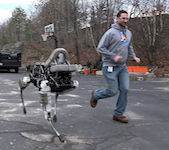
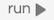
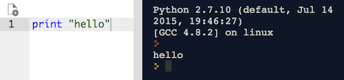

# Python

### Learning Objectives
*After this lesson, you will be able to:*
- Define programming languages
- Define Python
- Code in `repl.it` using Python

## What is a programming language?

There are over 7,000 spoken languages - French, Spanish, English, Dutch, just to name a few. Each of these do the same thing - allow humans to talk to each other - but in a different way ("I like this cat" versus "me gusta este gato"). The same way, there are thousands of programming languages - all different ways of accomplishing the same thing, which is giving computers instructions.

A *programming language* specifies a set of instructions that can be used to interact with a computer. It's also called a *coding* language, because we write code to create our programs.

Each of these programming languages specializes in something different - some languages are good for interacting with websites, some only make math applications, some are easier for humans to translate, and some are easier for computers to translate. But all of them really just do one thing: we write in different programming languages to get a computer to do something.

You can write a program to do anything. Call of Duty is a program. Your web browser is a program. You can write even programs to have a robot dog.

## Getting Started

In this class, we'll specifically be using a programming language called Python. To write our Python code, we're going to use a website that lets us practice right in the browser. [repl.it](https://repl.it/languages/python) is an interactive development environment that you can access from any web browser.  That is, you can go to a webpage and start coding immediately.

1. Follow this [repl.it](https://repl.it/languages/python) link. (If you're having trouble with the link or ever looking for a blank environment, you can type `https://repl.it/languages/python` into your favorite browser.)
  - **Note**: If repl.it ever asks you to log in or create an account, you can click "Continue as Anonymous" at the bottom of the log in panel.

2. Type the following into the panel on the left side of your browser screen: `print "hello"`

3. Click the  button

4. Look at the panel on the right side of you screen.  You should see something like 

You're coding!  You just made the computer print out the word "hello" (print, in computer terms, means "display on the screen").

Whenever you want your program to print something in Python, you use the command `print`. If you want your program to print words, you'll need to put quotes around them. Try changing the program to print your name.

This is only the beginning. We will show you a lot of other useful things that you can run with your code as we go through this course - you'll be python masters.

## repl.it for other programming languages

If you just type `https://repl.it` into your browser, it won't take you to the Python coding session you just used.  Rather, you will have to select what language you want to use with a dropdown menu.

We will only be using the Python option in this course, but you can code in your web browser with many other languages with `repl.it`. But for this pre-work, we'll always be using `https://repl.it/languages/python`.

## Conclusion

Now that you know how to use `repl.it`, it's time to learn the ins and outs of the Python language, which you will be using to solve problems throughout this course.  Let's get started!
