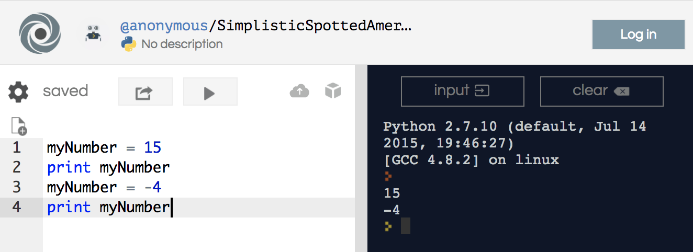

# Variables

### Learning Objectives
*After this lesson, you will be able to:*
- Create variables.
- Reassign variables.
- Create comments.

## Introducing Variables

The most basic piece of code is called a **variable**. Variables store information that can change. Think of them as boxes that can hold information for you.

You can store all kinds of things in a variable, but first, let's look at numbers. Here, we create a variable called `myNumber` and have it hold the number `15`.

```python
myNumber = 15
```

If we print out the contents of `myNumber`, Python will tell us that `myNumber` currently holds 15.

```python
myNumber = 15
print myNumber
```

You can click [this repl.it](https://repl.it/@SuperTernary/cybersec-variables-intro) to see this. Hit "run>". 15 should appear on the right side.


When you create a variable, it's called *declaring* a variable. The syntax for declaring a variable is what you want the variable to be named, followed by an equal sign, and finally what you want the variable to hold. Notice the space before and after the equal sign!
Try this out in [your repl.it](https://repl.it/@SuperTernary/cybersec-variables-intro).

Note that, in Python, the equal sign doesn't evaluate things the way it does in math. Instead, it assigns them values. Here, we're using the `=` to tell Python that the `myNumber` box is going to hold the value `15`.


### Reassigning Variables

We can always change what a variable is holding; it's just a container. Setting a variable to a value is known as *assigning* the variable. In our example above, we declared the `myNumber` variable and assigned it the value of `15`.

Once a variable is declared, you can always reassign it to a different value. Add a line to
.it that changes the variable, like the one below, and hit the run arrow.

```python
myNumber = 15
print myNumber
myNumber = -4
print myNumber
```



We can reassign our variable as many times as we want. However, only the most recent value of a variable will be retained. Once a variable is reassigned, its original value is lost forever. If you think of a box, reassigning a variable is like throwing away what's in the box and replacing it with something new.

On the first line, we are assigning the `myNumber` variable, setting it equal to the integer `15`. Then, on the next line, we are reassigning the `myNumber` variable, setting it equal to `-4`. `myNumber` is now equal to the integer `-4`; we threw away the value `15` and put the value `-4` in the box instead.


### Naming Guidelines

Variables are case sensitive. In [your repl.it](https://repl.it/@SuperTernary/cybersec-variables-intro), try adding `print MYNUMBER` to the end of your code and clicking "run." It will return an error. To a computer, `MYNUMBER` and `myNumber` aren't the same.

When you want to use a variable name consisting of several words, you will get an error if you have spaces between the words. Try creating a variable called `my number` and you'll get an error; specifically, one that says "Invalid Syntax."
- Syntax is the set of rules surrounding how a language looks. In the English language, we call syntax "grammar." For example, sentences always start with a capital letter and end with something such as a period, exclamation point, or question mark. Other languages have syntax, too, including programming languages like Python.
- Here, Python is telling us that putting a space between two words in a variable name is invalid syntax. It's not proper grammar and it will not run.

Instead, you can combine all of the words together into one long variable name. Variable names should be written in camelCase, which means the first letter of the first word should be lowercase and the first letter of any subsequent words should be uppercase. It's called camelCase because it resembles a camel with humps.


You can name a variable anything you'd like. Try naming a variable in [your repl.it](https://repl.it/@SuperTernary/cybersec-variables-intro) after your favorite animal and assigning it the number `9`. Then, print your variable.


## Side Note: Comments

In Python, you can put a comment in your code. This can be anything you want, and Python will ignore it. This is helpful for telling other people what your code does. You make a comment using the `#` symbol. For example, run this code in [this new repl.it](https://repl.it/@SuperTernary/cybersec-variables-intro2).

```python
yourGuitars = 15
# This is a comment! Python will ignore it.
# I have to put a new # on every new line that I want to be a comment - every time I hit return or enter.

print yourGuitars
# I can put comments anywhere in my code

nikhilGuitars = 52 # I can put a comment here, on the same line as my code, right after my code.

print nikhilGuitars
# I can't put code after the #, because Python won't know it's not part of the comment.
# The code on this line will not run. yourGuitars = 0

print yourGuitars
# yourGuitars is still 15.

# yourGuitars = 29
print yourGuitars

# Even though there are no other words next to "yourGuitars = 29", because it's after the #, it will not run. yourGuitars is still 15.
```

Comments are very helpful. We'll use them going forward to help explain what the code does as it gets more complicated.
## Conclusion
- In this lesson we covered how to create variables, how to reassign variables, and how to create comments. If you understanding what variables are and how they work, you are well on your well to building a strong foundational knowledge base of programming. Feel free to go back and review this content as needed. Also consider exploring some of the additional resources that follow.
### Additional Reading
- [Python For Beginners](http://www.pythonforbeginners.com/basics/python-variables)
- [Python Programming Tutorial: Variables](https://www.youtube.com/watch?v=vKqVnr0BEJQ)
- [Variables in Python](https://www.guru99.com/variables-in-python.html)
