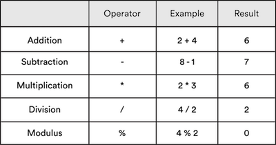
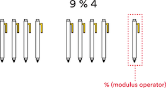
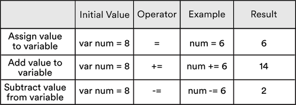

# Math

### Learning Objectives
*After this lesson, you will be able to:*
- Use numerical operators.
- Reassign variables using variables.
- Use math, modulus, and assignment operators.

## Numerical Operators

When we're dealing with variables that have numbers for values, the  `+`, `-`, `*` (multiply), and `/` (divide) operators work just like they do with regular math. What would you expect `myNumber` to equal after this code?

```python
apples = 15 - 4 # The apples variable now is equal to the value of 11.
print apples
oranges = 16 / 4 # The oranges variable now is equal to the value of 4.
print oranges
grapes = 13 + 2 # What do you think grapes is equal to?
print grapes
berries = 4 * 2 # What do you think berries is equal to?
print berries
```

Try running this in [repl.it](https://repl.it/@SuperTernary/cybersec-math-numericalOperators). Were you correct?


## Reassigning Variables Using Variables

A great thing about variables is that, because they store a value, you can use them later. For example, if we have a variable declared `myNumber = 15`, then we can use `myNumber` to mean `15` in our code. Here's an example:

```python
myNumber = 15
myNewNumber = myNumber + 4
print myNewNumber # This will print 19.
print myNumber # We haven't change myNumber - this will print 15.
```

Run that in [repl.it](https://repl.it/@SuperTernary/cybersec-math-reassigningVariables) to check.

You can also reassign a variable *using that very same variable*. This can be helpful for keeping track of things. For example, let's say you start with three guitars:

```python
yourGuitars = 3
```

Then, you give a guitar to Nikhil:

```python
yourGuitars = yourGuitars - 1 # You now have two guitars.
nikhilGuitars = 1
```

Then, Isabella gives Nikhil three guitars and borrows one from you:

```python
yourGuitars = yourGuitars - 1 # You now have one guitar.
nikhilGuitars = nikhilGuitars + 3 # Nikhil now has four guitars.
isabellaGuitars = 1
```

Now, you can just print those variables to see how many guitars everyone has:

```python
print yourGuitars
print nikhilGuitars
print isabellaGuitars
```


Here is the complete code:

```python
yourGuitars = 3
yourGuitars = yourGuitars - 1
nikhilGuitars = 1
yourGuitars = yourGuitars - 1
nikhilGuitars = nikhilGuitars + 3
isabellaGuitars = 1
print yourGuitars
print nikhilGuitars
print isabellaGuitars
````

Run this code in [repl.it](https://repl.it/@SuperTernary/cybersec-math-reassigningVariables2). Does everyone have the correct number of guitars?
- You and Isabella both have one and Nikhil has four.

You can also refer to other variables. Here, we start with the amount of guitars from above.

```python
yourGuitars = 1
nikhilGuitars = 4
isabellaGuitars = 1
```

Nikhil gives all of his guitars to you, and you give three of your guitars to Isabella. Then, Isabella gives half of her guitars to Daniel. Because all of these variables represent numbers, we can perform regular math on them:

```python
yourGuitars = yourGuitars + nikhilGuitars
nikhilGuitars = 0
isabellaGuitars = isabellaGuitars + 3
yourGuitars = yourGuitars - 3
guitarsForDaniel = isabellaGuitars / 2
isabellaGuitars = isabellaGuitars / 2

print yourGuitars
print nikhilGuitars
print isabellaGuitars
print guitarsForDaniel
```

How many guitars do you think everyone has? Try entering all that in [a blank repl.it](https://repl.it/languages/python) (don't forget the variable declarations code above) and running it.

Note the order we did those in. Why? For example, the line `yourGuitars = yourGuitars + nikhilGuitars` had to come *before* `nikhilGuitars = 0`. As soon as you reassign a variable, the original value is gone. Because Nikhil started with four guitars, we had to make sure to add those four to your guitars before setting the number of guitars Nikhil had to zero.


Note that we always put spaces around every operator (`+`, `-`, `*`, `/`) to make the code easier to read.

All of the standard arithmetic operators learned in grade school (addition, subtraction, division, and multiplication) are supported in Python.



These should look familiar, but if you don't have a background in programming, that last operator (the modulus operator) might be new.

## Modulus

The modulus operator shows the remainder of a division problem.

For example, nine divided by four equals two with a remainder of one. The modulus operator takes two numbers as inputs and returns what is left over from the division.



The modulus operator, `%`, is particularly useful in programming if we want to find out if a number is even or odd.

If we divide by two and have a remainder of one, we know the number is odd. If we have a remainder of zero, we know the number is even.

Let's look at some examples. You can test this in [repl.it](https://repl.it/@SuperTernary/cybersec-math-modulus):

```python
firstTest = 5 % 2 # This will divide 5 by 2 and tell us the remainder.
print firstTest # This will print 1. Therefore, we know the number is odd.

secondTest = 7 % 2 # This will divide 7 by 2 and tell us the remainder.
print secondTest # This will print 1. Therefore, we know the number is odd.

thirdTest = 4 % 2 # This will divide 4 by 2 and tell us the remainder.
print thirdTest # This will print 0. Therefore, we know the number is even.

lastTest = 2 % 2 # This will divide 2 by 2 and tell us the remainder.
print lastTest # This will print 0. Therefore, we know the number is even.
```

This may seem tedious now, but it'll come in handy later on.


## Assignment Operators
You're already familiar with the `=` assignment operator, but there are also ones we can use to add or subtract value from a variable. Take a look:


The `+=` operator adds a value to an existing variable.
- For example, saying `myNumber += 1` is exactly the same as saying `myNumber = myNumber + 1`. It's just a shorter way to write it.

The `-=` operator subtracts a value from an existing variable.
- For example, saying `myNumber -= 1` is exactly the same as saying `myNumber = myNumber - 1`. Again, it's just a shorter way to write it.

> Note: Keep in mind that we'll always need an `=` somewhere in the line of code when we want to either assign or update the value of a variable, as in the chart above.

Enter this in [a blank repl.it](https://repl.it/languages/python) and see what happens. What's the final value of `myNumber`?

```python
myNumber = 8
print myNumber
myNumber += 3
print myNumber
myNumber -= 5
print myNumber
```

Answer: The final value of `myNumber` should be `6`.

While we've covered what seems like a lot of math in this section, don't worry: You're not going to be doing calculus in this course. However, it's important that we review these concepts, because there will be many times when you'll solve a problem using basic principles. When it comes down to it, computers operate with a simple, straightforward logic.

## Conclusion
- In this lesson we covered how to use numerical operators, how to reassign variables using variables, and how to use math, modulus, and assignment operators. Consider reviewing this material again to help it sink in. Also, explore the additional readings that follow to strengthen and deepen your understanding of this lesson's concepts.

### Additional Reading
- [How To Do Math in Python 3 With Operators](https://www.digitalocean.com/community/tutorials/how-to-do-math-in-python-3-with-operators)
- [How To Use Variables in Python 3](https://www.digitalocean.com/community/tutorials/how-to-use-variables-in-python-3)
- [Modulus Operator](https://www.youtube.com/watch?v=MrTtsX2Wg9Q)
-[The Assignment Operator](https://www.youtube.com/watch?v=x6FiPx4Xl6A)
