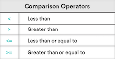

# Comparison, Logical Operators, and Booleans

### Learning Objectives
*After this lesson, you will be able to:*
- Explain different comparison and equality operators (`<, >, <=, >=, ==, !=`).
- Use logical operators to compare values.

## Comparison and Logic in Programming

Logical operators in Python allow for comparisons between two or more variables. Mostly, we will be comparing strings and numbers, but Python also allows us to compare some more complex data types, which we will learn about soon. Without the ability to make decisions based on conditions, our programs would be boring indeed. They would be nothing more than a sequence of instructions that were always executed the same way! But, if our scripts can look at the current state of what's happening in the application and make decisions based on that information, then they can become far more intelligent and adaptive.

### Comparison Operators

First, it's important to understand that the result of comparing two values is always either the value `True` or the value `False`. These are called **Boolean values** and they are the basis for all decisions in programming. Comparison operators compare two values with one another and return either `True` or `False`.

Comparisons can be made using `<`, `>`, `<=`, and `>=` and work for both strings and numbers.



Here are a few examples of how the comparison operators work:

```python
3 < 5     # Result is `True` because 3 is less than 5.
13 >= 13  # Result is `True` because 13 is greater than or equal to 13.
50 > 100  # Result is `False` because 50 is *not* greater than 100.
"d" < "a" # Result is `False` because "d" is *not* less than "a."
```

Why is that last one false? Because "d" occurs after "a" in the character set. To a computer, characters go "a," "b," "c," "d"... Because "d" is after "a" in a computer's order, "a" < "d." Therefore, this string comparison will evaluate to `False`.

### Equality Operators

Now, let's take a look at equality operators.

Equality operators check to see whether or not two values are the same as, or equal to, one another.

- Equality (`==`):
  - This operator will accept any two types of data as inputs and evaluate to a Boolean value (`True` or `False`).
  - It will only evaluate to `True` if both sides are completely identical in data type and value (i.e., a string and a number will never be equal because they are different data types.)
  - For example, `5 == 5` will evaluate to `True`, while `5 == "5"` will evaluate to `False`, as, while the values are the same, `5` is a number and `"5"` is a string. (Strings always have quotes.)

- Inequality (`!=`):
  - This operator will also accept any two types of data as inputs and evaluate to a Boolean value.
  - It is essentially the reverse of the equality operator — it compares two values to check that either the data type or the value are not the same.
  - For example, `5 !== 5` will evaluate to `False`, while` 5 != "5"` will evaluate to `True`.

What do you think the following will equal?
- `8 > 8`
- `8 >= 8`
- `8 < 8`
- `8 < 13`
- `8 <= 15`
- `7 == 7`
- `7 == "7"`
- `7 != 7`
- `7 != "7"`
- `6 == 7`
- `6 != 7`

Try typing all of this (practice!) and then printing it out into [repl.it](https://repl.it/@SuperTernary/cybersec-comparisons) to see. We've done the first one.

The answer is...
- `8 > 8` is `False` — 8 is not greater than 8.
- `8 >= 8` is `True` — This checks if 8 is greater than or equal to 8, and they are equal.
- `8 < 8` is `False` — 8 is not less than 8.
- `8 < 13` is `True` — 8 is less than 13.
- `8 <= 15` is `True` — 8 is less than or equal to 15.
- `7 == 7` is `True` — 7 is equal to 7.
- `7 == "7"` is `False` — One is a number and the other is a string.
- `7 != 7` is `False` — This checks if they aren't equal. Because does 7 equal 7, it's `False`.
- `7 != "7"` is `True` — This checks if the number 7 and the string "7" aren't the same, and indeed they aren't.
- `6 == 7` is `False` — 6 is not equal to 7.
- `6 != 7` is `True` — 6 is not equal to 7.

## "Truthy" and "Falsey"

`True` and `False` are the standard Boolean values that we'll be using with our comparisons. However, in Python, there are also other values that will evaluate to `True` or `False` if they are used in a comparison. These are called "truthy" and "falsey" values because they are not explicitly `True` or `False` but they implicitly behave in the same way.

Any string (or other collection, like a list, which we'll learn about soon) that is **empty** is considered "falsey," so it evaluates to `False`. Similarly, any number with a value of zero is considered `False`. In these situations, `True` and `False` results basically indicate whether or not the variable you are comparing contains a value.

Here are a few examples:

```python
"Hello, World!"  # A non-empty string is "truthy," so this is `True`.
13               # A non-zero number is also "truthy," so this is `True`.
""               # An empty string is "falsey," so this would be `False`.
0                # The number `0` is "falsey," so this would also be `False`.
```

### The Logical Operators: `or` and `and`

Now we know how to compare two values and get a Boolean result. But, what if we need to compare multiple things that must all be `True`? Or compare multiple things, any one of which must be `True`? This where the `and` and `or` operators come into play.

#### `or`
`or` checks if **either** comparison is `True` and returns the first `True` value it finds. If neither side is `True`, then `or` returns `False` and the last `False` value.

Here is a list to help keep track. A list like this is called a *truth table*.

```python
- True or True # This will be `True` because one of the sides is `True`.
- True or False # This will be `True` because one of the sides is `True`.
- False or True # This will be `True` because one of the sides is `True`.
- False or False # This will be `False` because neither side is `True`.
```

Here are a few more examples with variables like we might see in a real script:

```python
redScore = 7
blueScore = 5
greenScore = 0
yellowScore = 0

redScore or blueScore
# Both variables exist and are non-zero, so they're `True`. Thus, this is `True`
greenScore or blueScore
# greenScore is `0`, which means it's `False`.
# However, blueScore is non-zero, so this comparison is `True`.
greenScore or yellowScore
# Both values are `0` (`False`), so this will result in `False`.
```

In the same repl.it you had above, print all of these out.


#### `and`
`and` checks if **both** comparisons are `True`. If both sides are `True`, then `and` will give back the last `True` value. If either side is `False`, `and` will return the first `False` value it finds.

Here is a truth table to help keep track:

```python
True and True # This would be `True` because both sides are `True`.
True and False # This would be `False` because both sides are not `True`.
False and True # This would be `False` because both sides are not `True`.
False and False # This would be `False` because both sides are not `True`.
```

Here is an example using variables. Try this out in repl.it:

```python
redScore = 7
blueScore = 5
greenScore = 0
yellowScore = 0

redScore and blueScore
# Both variables exist and are non-zero, so both are `True`
# Therefore, the result is `True`.
greenScore and blueScore
# greenScore is `0`, which means it's `False`.
# blueScore is non-zero, which means it is `True`.
# But, because both are not `True`, the final result is `False`.
greenScore and yellowScore
# Both values are `0` (`False`), so this will result in `False`.
```

## Wrap-up and Control Flow Introduction

You now have most of the tools necessary to let your scripts make intelligent decisions to control the flow of execution:

* Comparison operators, `>`, `<`, `<=`, `>=`, and equality operators, `==` and `!=`, are used to test values for equality and inequality.
* Comparisons always result in a `True` or `False` value.
* The `or` and `and` operators allow us to chain multiple comparisons together.
  * `or` evaluates to `True` if **any** of the comparisons are `True`.
  * `and` evaluates to `True` only if **all** of the comparisons are `True.`

Next, we'll see how we put these operators to work in our scripts to actually change the flow of execution.
