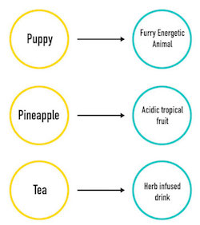
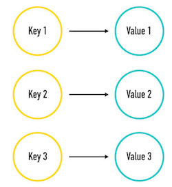

# Tuples and Dictionaries

### Learning Objectives
*After this lesson, you will be able to:*
- Explain how a list, tuple, and dictionary differ from each other.
- Explain the best-case uses for each type of collection.
- Use tuples and dictionaries to solve common problems in Python.

## Introducing Tuples

Before learning about loops, we learned about lists, which are a fantastic way to store data items in a single place and be able to access them using a zero-based index. When we access the elements in a list, we can use them in other parts of our script or modify them to contain new values. This is obviously a powerful data structure and (as the saying goes) "with great power comes great responsibility." But some coders are lazy and don't always want that kind of responsibility. So, Python offers another structure that trades some of that power for more limited (but secure) usage: the tuple.

A tuple is nothing more than a list with elements you cannot change; they are fixed and constant. We say that they are __immutable__, meaning they cannot be mutated, or changed.
- Once you create a tuple and assign its elements, those elements cannot be removed or modified in that tuple.

But, why is this anything we would want? Isn't it more useful to work with a list that allows us to change elements when necessary? Doesn't this inflexibility make our code easier to break?

On the contrary — this kind of data protection through immutability makes our code much more stable and frees it from a whole class of data-mutator bugs.
- Think of it as the Python equivalent of the padded egg carton: It protects your eggs from things that shouldn't be messing with them (in this case, the eggs being your data).

We will frequently need the power to create and edit lists, adding and removing items from them. In these instances, use a list. However, if you have a list-type bit of data in your script that you know __will__ never change and __should__ never change, **you should use a tuple.**

## Code-Along: Tuple Syntax
Use this blank [repl.it](https://repl.it/languages/python) workspace for this challenge.

Tuples work exactly like lists, except that, when you create a tuple, you use parentheses instead of square brackets. You can include anything you want, but, for now, we'll add strings:

```python
tup1 = ("red", "orange", "yellow", "green", "blue", "violet")
```

Accessing these elements is still done with brackets and numbers representing indices:

```python
tup1 = ("red", "orange", "yellow", "green", "blue", "violet")
print tup1[0]    # outputs 'red'
print tup1[1:4]  # outputs ('orange', 'yellow', 'green')
```

However, you can't do this:

```python
tup1 = ("red", "orange", "yellow", "green", "blue", "violet")
tup1[0] = "crimson"
```

The tuple protects the elements it contains. The code above throws an error: `TypeError: 'tuple' object does not support item assignment`. So, if some other module happens to have a naming conflict with one of our variables, using a tuple on our end prevents unexpected modification of the collection and saves us a ton of debugging time.

Because we're already here, why don't we print out this tuple using a `for` loop. We should remember how:

```python
tup1 = ("red", "orange", "yellow", "green", "blue", "violet")

for color in tup1:
  print color
```

This creates a loop that will iterate once for each item (color) in our tuple (`tup1`). In each iteration, the loop
prints the color value on its own line. Lists, strings, tuples, and (as we will see shortly) dictionaries are exactly the kind of collections for which the `for` loop was created.

## Introducing Dictionaries

Fantastic! Now we know of a more specialized type of list that protects our elements. We can use this when we know our data set is constant. Python also provides us with another kind of list: a dictionary.

A dictionary in Python works much like an actual dictionary: Say you want to find the definition associated with a given word. You go to the dictionary and turn straight to the word you are interested in. You don't have to iterate through all of the definitions that come before your word, and you don't have to know its exact index number. You simply need to know the word, and then you can access its definition.



A dictionary goes further than a tuple. It also stores a collection of whatever kinds of data we like, but it doesn't use ordered integers to index its contents. Instead, it uses more meaningful __keys__. A key, like an index, is a direct reference to that element in the dictionary. We call that a **key-value pair**: The key is used to find the associated value. What's more, a key can be any string or integer we like, in whatever order we like.

Just like you can look up any word in the dictionary to get the definition, you can just use a key in a dictionary to find the value. This is known as a key-value pair, hence the definition of a dictionary: a set of key-value pairs.



In a dictionary, all keys must be unique. For example, imagine you went to look up the word "pineapple" in the dictionary and it was listed three times. Which entry would be the correct one? You wouldn't know.

Dictionaries are especially useful when you have a small-but-meaningful "key" data point that can be used as an index for an associated value in the collection. For example, if we had a collection of cars with each car linked to the first name of its owner. The elements can be anything we want.

Let's get some practice:

## Code-Along: Dictionary Syntax

Use this blank [repl.it](https://repl.it/languages/python) workspace for this. When you see code, type it in - follow along to see what's happening.

Dictionaries use the curly braces to denote the start and end of the collection (like lists use brackets and tuples use parentheses). Because we are using keys instead of indices, we need to enter our elements with **the key and the value together**, separated by a colon:

```python
friendzips = {98107: "Lauren", 92211: "Markus", 90210: "Brenda"}
```

Here, our dictionary is called `friendzips`, `98107` is a key, and `"Lauren"` is the value that goes with that key.

Now, we can use the keys (zip codes, in this example) to find the values, i.e., the friend we have in that zip code:

```python
friendzips = {98107: "Lauren", 92211: "Markus", 90210: "Brenda"}
print friendzips[92211]
```

We're asking Python to look at the dictionary `friendzips` and print the value for the key `92211`. This will print `"Markus"`.

If Markus moves away and we want to change the value associated with `92211` with the new person that moves in, then we can easily do so in a similar fashion to how it's done with a list:

```python
friendzips = {98107: "Lauren", 92211: "Markus", 90210: "Brenda"}
print friendzips[92211]

friendzips[92211] = "Jackie"
print friendzips
```

When we run this, we see that the value at the `92211` is replaced with `'Jackie'`. It's as simple as that to get or set values in a dictionary!


**Note**: The order of names you see printed may differ from how you entered them. It's important to know that dictionaries have no inherent order!
- The items that are returned when you access a dictionary come in any order they please.
- This doesn't really matter that much, however, because the typical use case for a dictionary is when you know the exact key for the value you're looking for.
- But, you should never count on the contents of a dictionary being in any order at all.

What happens if you try to print a key that isn't defined? Try running the code:

```python
print friendzips[151]
```

You'll get an error.

### String Keys

It is also common to use strings for keys. Here, we'll also demonstrate another way of formatting dictionaries to make them easier to read. Let's start by adding a new dictionary - follow along in the same repl.it.

```python
bookAuthors = {"The Elegant Universe": "Brian Greene",
  "The Alchemist": "Paolo Coelho"}
```

If you print `bookAuthors`, it should work.

Now, let's try making a dictionary that has lists for the values:

```python
friendstates = {
  "CA": ["Marvin", "Joann", "Joe"],
  "WA": ["Trevor", "Courtney", "Brianna", "Daniel"],
  "NY": ["Ivan", "Martha", "Rebecca"]
}
```

This one uses state abbreviations as keys, and each one points to a list of names. We can even use dictionaries as values!

Notice that each item is on one line ending with a comma. We still have our **key-value** pair format separated by commas, however, making it easily readable to a human, which is a good thing.

And that's not just with dictionaries of lists; we can do this with any dictionary, regardless of its contents. The syntax will remain the same, it's simply a formatting change. Let's try this using the `friendzips` dictionary. Change your dictionary to look like this:

```python
friendzips = {
  98107: "Lauren",
  92211: "Markus",
  90210: "Brenda"
}
```

This creates the same dictionary, but the line-by-line formatting makes it easier for a person to read, which saves time during maintenance. This is a best practice, so anyone helping you (or you in the future) can easily see what your code does.

### Looping Through Dictionaries

Now, how do we loop through a dictionary? We can use the same `for` loop structure, but, instead of it iterating over each element in the collection, it will iterate over each key. We can then use the key to access the value:

```python
friendzips = {
  98107: "Lauren",
  92211: "Markus",
  90210: "Brenda"
}

for key in friendzips:
  print friendzips[key]
```

The lines in our `for` loop work like this:

* The first line says, "For every key in the `friendzips` dictionary..."
* The second line says, "... print the value in `friendzips` associated with the provided key."

## You-Do: Collection Identification Practice
Use this blank [repl.it](https://repl.it/languages/python) workspace for this practice.

1) Identify the type of each collection (list, dictionary, tuple):

```python
# a.
coll1 = (3, 5, 7, "nine")
# b.
coll2 = ["X", "Y", "Z"]
# c.
coll3 = {"SM": 8, "MD": 12, "LG": 16}
```

2) What type of collection should we use if we know the elements should never be changed?

3) Write a tuple containing strings naming the foods you've eaten in the past six hours. How would you change it to a list?

4) Write a script that declares a dictionary named `letters`. Add a key to this dictionary for each unique letter in your full name (first and last). The value for these keys should be how many times that letter appears in your name. As an example, here are the dictionaries you'd make for the names "Joe" and "Callee:"

```python
lettersJoe    = {"j": 1, "o": 1, "e": 1}
lettersCallee = {"c": 1, "a": 1, "l": 2, "e": 2}
```

5) Using the dictionary you just created, write a loop below it that prints a nice message telling us the number of occurrences of a letter in your name. Something like:

```python
print 'The letter ' + key + ' appears in my name '
  + str(letters[key]) + ' time(s).'
```

## Conclusion
Here are the key takeaways from this lesson:
* A tuple is a kind of collection, like a list, except that the elements are **immutable**, meaning they cannot be changed.
* A dictionary is another kind of collection, similar to a list, except that it uses **keys** to access elements instead of indices.
* Tuples should be used instead of lists when you know that the items should remain constant.
* Dictionaries should be used instead of lists when you don't care about the order of the items and when you'd prefer more meaningful keys than integers for accessing the collection's values.
* All three of these collection types can use `for` loops for easy iteration over all contents.<br>

To deepen your understanding, consider exploring some of the resources in the Additional Reading section that follows.

### Additional Reading
- [Python Tuple](https://www.programiz.com/python-programming/tuple)
- [Tuples](http://openbookproject.net/thinkcs/python/english3e/tuples.html)
- [Strings, Lists, Tuples, and Dictionaries Video](https://www.youtube.com/watch?v=19EfbO5D_8s)
- [Python Data Structures: Lists, Tuples, Sets, and Dictionaries Video](https://www.youtube.com/watch?v=R-HLU9Fl5ug)
