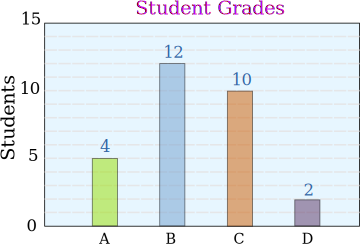

# Sets

### Learning Objectives
*After this lesson, you will be able to:*
- Create variables that hold sets.
- Use sets to determine the frequency of elements.

## Introducing Sets

Earlier, we discussed a *list*, which is a collection of *elements*.

A list is contained within square brackets `[]` like this:

```python
colors = ["red", "yellow", "green"]
```

However, there is a specific version of a *list* called a *set*. What makes a set different is that all of the *elements* in a *set* must be unique. That is to say, nothing can appear more than once in a *set*.

Creating a *set* is easy; we just need to use the `set()` method like this:

```python
set(["red", "yellow", "green", "red"]) # We type this
	=> {"green", "yellow", "red"} # But python creates this set
```

Because we had two `red`s, Python removed the extra one for us. Try running that in this [repl.it](https://repl.it/@SuperTernary/cybersec-sets)

Because a variable is just a box that can hold information, it can also hold sets. We can use the following to determine if something is a set:

```python
unique_colors = set(["red", "yellow", "green", "red"])
print(type(unique_colors)) # "type" tells is what the variable is
	=> <class 'set'> # Python tells us the variable is a set.
```

Change your code in your repl.it to match the first two lines of this code and run it.

Next, we will look at a common application for sets: a histogram.

## Histogram Activity

A **histogram** is a representation of the distribution of data.  That is to say, it shows how many of each type of thing you have in a data collection.  You may already be familiar with the concept of a **histogram** as it relates to bar charts.

<!--I got this off the internet, should we make one in-house for legal reasons? -->



The **histogram** above is showing, out of a class of 28 students, how many received a grade of A, a grade of B, a grade of C, or a grade of D.

Consider the following list:

```python
grades = ["B", "B", "B", "D", "C", "B", "B",
  "B", "B", "C", "B", "C", "B", "D", "B", "C",
  "A", "C", "B", "C", "A", "A", "B", "C", "C",
  "C", "A", "C"]
```

How could we determine how many As, Bs, Cs, and Ds there are?  We could count them, but imagine if this list contained 500, or even 50,000 grades.  How could we quickly determine our grade distribution?  By using Python *sets*.

But, before we get there, we should talk about the `count()` method for lists.  We want to see how many As, Bs, Cs, and Ds there are in the grades list, which we can do like so:

```python
grades.count("A")
	=> 4
```

That's the same amount of As as the bar chart above, and we didn't have to count anything by hand. Nice!

Now, let's use *sets* and our new `count()` method to find out the frequency of *all* the grades.

```python
grades = ["B", "B", "B", "D", "C", "B", "B",
  "B", "B", "C", "B", "C", "B", "D", "B", "C",
  "A", "C", "B", "C", "A", "A", "B", "C", "C",
  "C", "A", "C"]

# Make a set with just {"A", "B", "C", "D"}

unique_grades = set(grades)
# Go through all four grades
for grade in unique_grades:
  # And print out how many people got that grade
  print(str(grades.count(grade)) + " people got a(n) " + grade)
```

Try running this code in [repl.it](https://repl.it/@SuperTernary/cybersec-sets-histogramActivity), and see how many people got each grade.  It should have the same numbers per grade as the bar chart above.

## You-Do: Build Your Own Histogram
Use this [blank repl.it](https://repl.it/languages/python) workspace for this activity.

Take the set below and figure out how many times each number appears:

```python
numbers = [22,3,2,4,7,7,3,21,25,26,89,46,34,22,11,22,4]
```

## Conclusion
In this lesson, we covered how to create variables that hold sets, as well as how to use sets to determine the frequency of elements. Feel free to go back and review this material as necessary.

Sets are very useful when you use to store a collection of items, but you cannot have duplicates.

Sets really come in handy when storing:

- Emails
- Colors
- Usernames
- Names
- ...and anything else which is supposed to be unique, which you'll run into often in networking!

To deepen your understanding, consider exploring some of the resources in the Additional Reading section that follows.

### Additional Reading
- [Python Count Occurrences of Letters, Words and Numbers in Strings and Lists-Video](https://www.youtube.com/watch?v=szIFFw_Xl_M)
- [Storing Multiple Values in Lists](https://swcarpentry.github.io/python-novice-inflammation/03-lists/)
- [Sets and Frozen Sets](https://www.python-course.eu/sets_frozensets.php)
- [Sets](https://www.learnpython.org/en/Sets)
