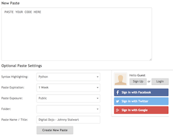

# Project: Part 4

Congratulations on making it to the end of the python section! Now it's time for your final challenge.

> **You'll need to submit your code for this challenge to Katy Stover by noon on Sunday, January 28.** We'll review the solution at the beginning of class. The instructions for submitting your code are below the challenge.

## Challenge 7: Refactoring

In Challenge 6, you wrote a function called `analyzeTraffic` that took a list of IP addresses and returned a new list, called `blacklist`, containing only those addresses that had appeared too many times.

```python
def analyzeTraffic(addresses, limit):
# Define a new function called `analyzeTraffic()`
# that takes two arguments, `addresses` and `limit`.
  hist = {}                    
   # Create a dictionary to hold the counts of how many times you've
  # seen each unique address.
  for address in addresses:
    # For each address in the list of addresses...
    if address not in hist:
      # ... if you encounter an address that isn't in the dictionary yet...
      hist[address] = 0     
      # ... create an entry in the dictionary for that address
      # with a value of 0 (see below).
    hist[address] += 1            
    # Whether or not the address was new, it should now be in the dictionary,
    # so add 1 to its count.
  blacklist = []                
  # Create a new empty list called `blacklist`.
  for address in hist:         
     # For each unique address in the dictionary...
    if hist[address] > limit:     
      # ... if that address appeared more than the number of
      # times specified by `limit`...
      blacklist.append(address)    
       # ... add it to the list `blacklist`.
  return blacklist              
  # Return that list back.
```

In this challenge, you're going to **refactor** this `analyzeTraffic()` function using what you've just learned about sets and counts.

**Refactoring** refers to when you change the inner workings of a piece of code _without changing how it behaves on the outside_.

Is there a way to produce the same behavior using a shorter program? Give it your best shot!

<!--
### Solution Code:
```python
def analyzeTraffic(addresses, limit):
# Define a new function called `analyzeTraffic()` that takes two arguments, `addresses` and `limit`.
  blacklist = []                        # Create a new empty list called `blacklist`.
  uniqueAddresses = set(addresses)      # Create a set of unique addresses from the original set of addresses.
  for address in uniqueAddresses:       # For each address in the set of unique addresses...
    if addresses.count(address) > limit:  # ... if that address appeared more than the number of times specified by `limit`...
      blacklist.append(address)             # ... add it to the list `blacklist`.
  return blacklist                      # Return the result, `blacklist`.
```
-->

To work on this, open a new repl.it by [clicking this link](https://repl.it/languages/python). When you're finished, submit it by:

1) Copying your solution code into [this website](https://pastebin.com/), which specializes in sharing code snippets.
2) Under "Syntax Highlighting," choose Python (there are two Pythons in the dropdown menu — pick the top one).
3) For "Paste Expiration," set this as "1 Week." <br>
4) Most importantly, for "Paste Name / Title:" type "Digital Dojo - Your Name."

So, if my name were Johnny Stalwart, my form would look like this:



Then, copy the URL (it will look something like `https://pastebin.com/TwaEnVaga0F`) and send it to Katy Stover on Slack. You've now finished the Python section! Great job.

Next, let's talk about how you actually access your in-class materials.
